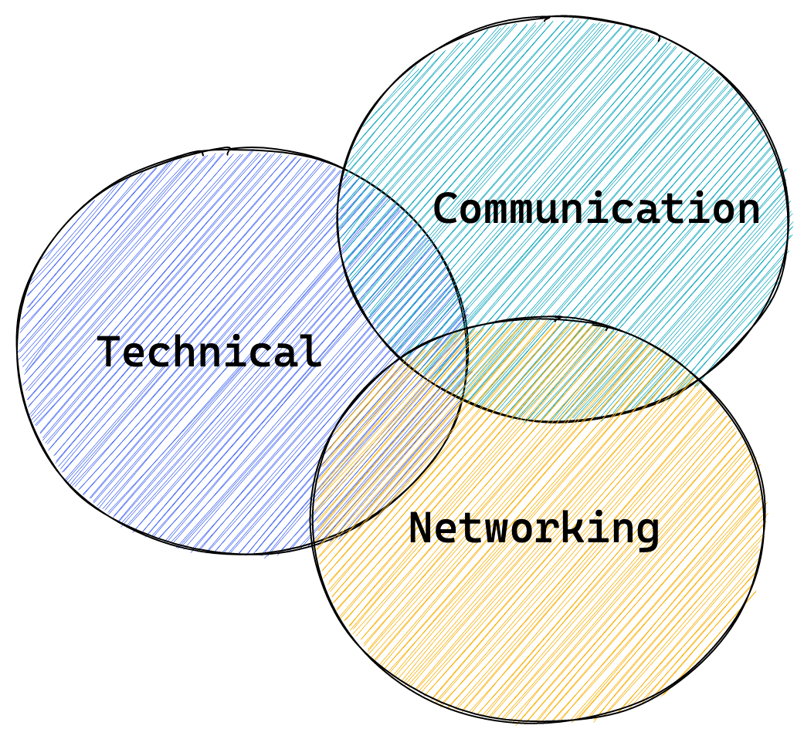

Improving in three skills are important to get into a web development job from zero. But remember everyone starts from zero at some point in life.

The important three skills are,

- Technical Skills (Hard skills)
- Communication (Soft skill)
- Networking (Soft skill)

<figure class="image">
  
  <figcaption>Three overlapping skills</figcaption>
</figure>

Your expertise on these skills decide how sooner you can get into a job. The better your skills are the more competitive you are. On the image, when you get to the region where all three circles overlap, [your luck](https://www.swyx.io/create-luck) surface is widened.

Let me expand on those three skills,

## Technical Skills

According to me, this is currently the Getting Started Kit for web development.

1. [FreeCodeCamp](http://freecodecamp.org) - To get started with practical learning of basics. You would how do you learn here and on your smooth progress.
2. [MDN web docs](https://developer.mozilla.org/en-US/docs/Web) - Reference document to learn about specifics. You would go back here when you want to understand a certain area better or just to get the syntax to use them properly. They also have tutorials and learning materials.
3. [StackOverflow](https://stackoverflow.com) - An online Q&A forum. It has answers for almost everything already. Search your specific question online, StackOverflow has answer for you. Sign up on this forum and get involved by contributing as well.

When you evolve from a beginner, you will know where else you will have to learn and grow. That will be influenced based on your networking skill. I will cover that in the Networking skill section.

## Communication skill

In this planet, every species communicates in a way or another. So, it also means your life would be much better with a better communication skill. Job Interviews are built in ways that interviewers validate your technical and communication skills. Resumé is the first gateway where this validation happens. Have you thought about how do they do it just with your resumé?

Communication skill is not straightforward like the technical skills. It varies since there's no set in stone way of communication. Even setting in a stone is a way of communication. 😅 So, it comes down to the requirement the job has, what the recruiting manager thinks is a better communication, and what the society has normalised as a better communication.

For example, in India, if you speak and write English well, you are one step ahead already. It's the society norm. Most of the times, the recruiting manager may not think more than the society and industry norms. The job would require certain communication skills. Such as, Email writing for a email support staff, public speaking for a marketing staff, writing and English proficiency for technical writing staff, and documentation skill for any engineering role.

Find the necessary skills and come up with a plan to learn them as start learning your technical skills. For instance, I started learning English by reading books and watching movies in English when I was getting better at my technical side as well. Technical writing and public speaking are other skills that I picked up in the recent years with my interest leaning towards them.

## Networking skill

Networking is a powerful yet untapped skill for many. It works pretty well and it is easily recognisable to see it's benefit better than the other soft skills.

When you join a more relevant tribe, you feel motivated. There are tech communities that can be considered a relevant tribe for your target technology. For example, I joined Chennai.js community to get better in JavaScript and to connect with folks in my living city (Chennai).

The online forums and social networks open up the entire world for you. It is not limited by geographical limits anymore. I'm in another community in WhatsApp to join folks who learn international languages and I'm the only among the few from India and I have friends now in countries that I do not even know where is it in map. 😅

Three steps you can start doing today:

1. Join local tech communities. I found some communities on Meetup app.
2. Use social networks where the like-minded people roam around. After you have entered into a different world of technology, you would have to change your tribe anyway. Why not try it early? I notice Twitter and LinkedIn is where web developers are usually active. There could be others I may not know.
3. When consuming content from the Internet, make room in your mind by not reading anything outside your focus area (Web development and software technologies, in this case). This would give you more time to read more within your focus area. Anyway, we would be interested to read about specific trends and topics outside our focus area that we will anyway read. That is totally fine as long as it doesn't consume majority of your reading time.

Right networking also provides you right content to consume at the right time. Finally, the benefit you get from joining tech communities and social networks are usually by-products. Find a reason to do it. For example, I first felt alone in the tech world with my specific growth mindset and I needed more similar folks to keep my motivation.