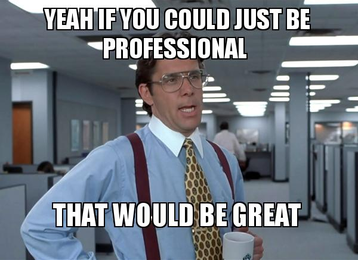

# What is clean code?
Well, Ideally, a properly written code by a professional is what is called as clean code.

> Writing clean code is what you must do in order to call yourself a professional. There is no reasonable excuse for doing anything less than your best. - Robert C. Martin

How is it written will be covered in the latter part of this series. Let's see why is it important and what advantage does it provide you, your company, and your future self. :wink:

# Why clean code?

Clean code in a project provides efficiency to the engineers over the time that it makes it easier to make changes in the future, easier to troubleshoot bugs, easier to add or remove a particular component without side-effects and there are a lot more advantages.

> The code easier to read is easier to write.

Everybody has deadlines. Everybody has a client or customer who wants the code to be deployed soon. You're responsible for the code, not your boss, not your customer.

> We like to think that we mostly do power typing. But we actually do is staring at the Abyss. - Douglas Crockford

We may think we are going fast by skipping certain principles of coding and agile methodology. But, we are actually going slow.

Before the application gets released, there will be bugs while testing the application for usability. We will go back to fix the bugs. There will be multiple releases for each bug fix cycle.
Considering this fact, dirty code has more cost with respect to time. To say the truth, it actually takes more time than writing clean code.

As a matter of fact, the ratio of time spent reading code versus writing is well over 10 to 1.

It's the "craftsmanship" that puts you behind the left door.

> There are two parts to learning craftsmanship: knowledge and work. You must gain the knowledge of principles, patterns, practices, and heuristics that a craftsman knows, and you must also grind that knowledge into your fingers, eyes, and gut by working hard and practicing. - on the book, Clean Code by Robert C. Martin (Uncle Bob)

Take doctors, for example. Will you accept for them to skip a few practices like washing hands before surgery?
For accountants to skip copying certain records for auditing purposes?

Every professionals follow their own set of principles and practices. Being professional is what makes a clean code possible.

> “It is not enough for code to work.” - Robert C. Martin

What impacts a dirty code has?

* It gets difficult to maintain the code. Remember the [Open-Closed principle](https://en.wikipedia.org/wiki/Open-closed_principle).
* As it is difficult to add features, the project backlog grows and slows down the application releases.
* Over time, it results in poor performance of the application.
* New developers joining the project get confused while reading the code to work on it.
* You or your company may end up losing the contract of the client.
* Poorly written code welcomes security breaches.

# What's next?

> First, it is through practice in the small that professionals gain proficiency and trust for practice in the large. Second, the smallest bit of sloppy construction, of the door that does not close tightly or the slightly crooked tile on the floor, or even the messy desk, completely dispels the charm of the larger whole. That is what clean code is about. - James O. Coplien

In painting, knowing the difference between the good art paint to the bad one does not mean we know how to paint. In the same way, the ability to differentiate clean code with the dirty code does not mean we know how to write clean code.

In the following articles in this series, let's see how to write clean code by following certain practices, follow a checklist of a professional, and how each of them will help for the better.
